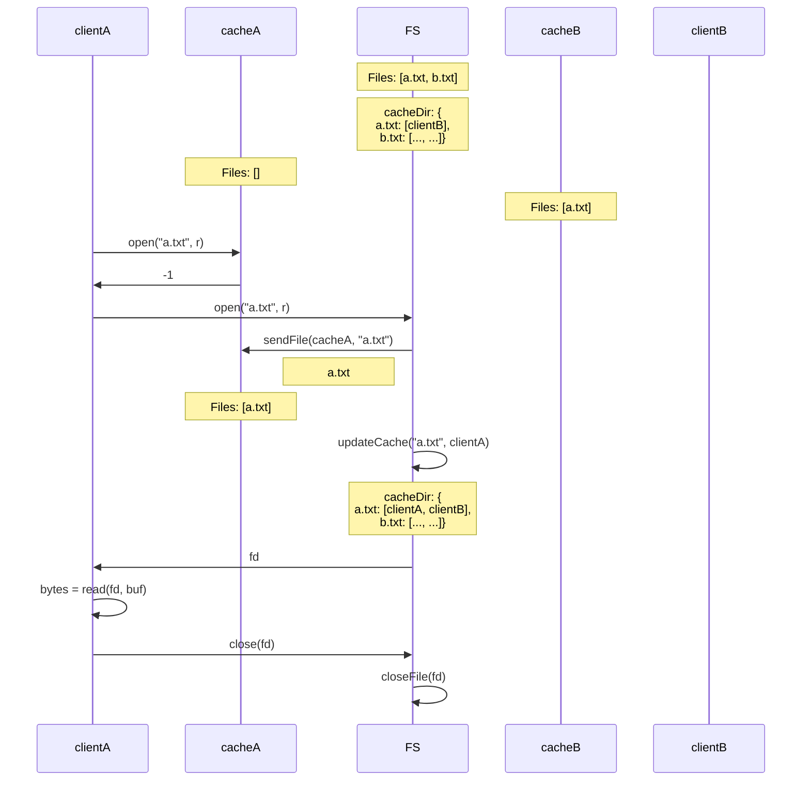
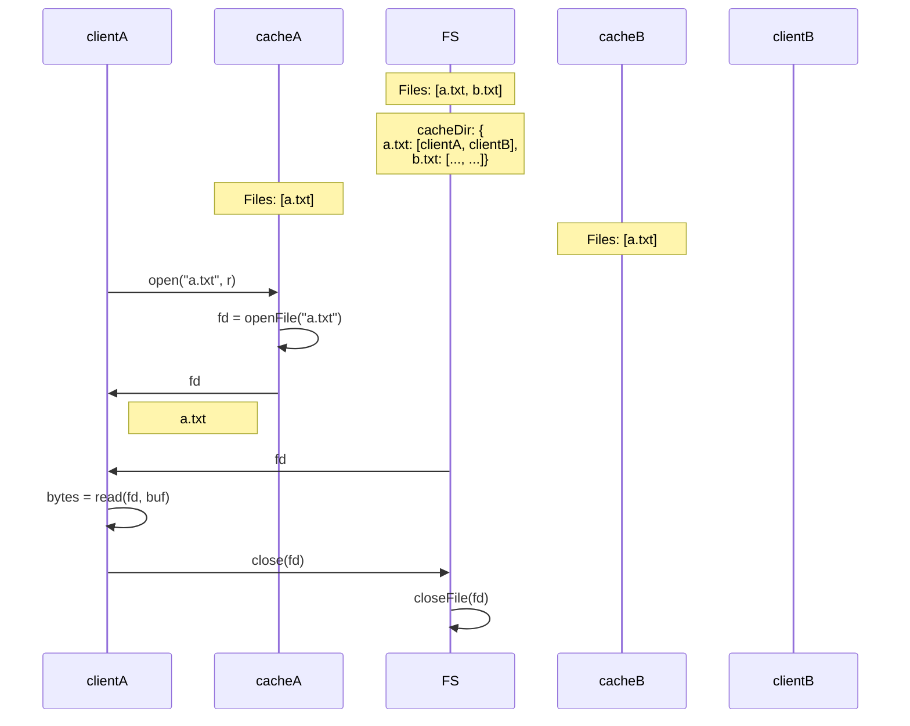
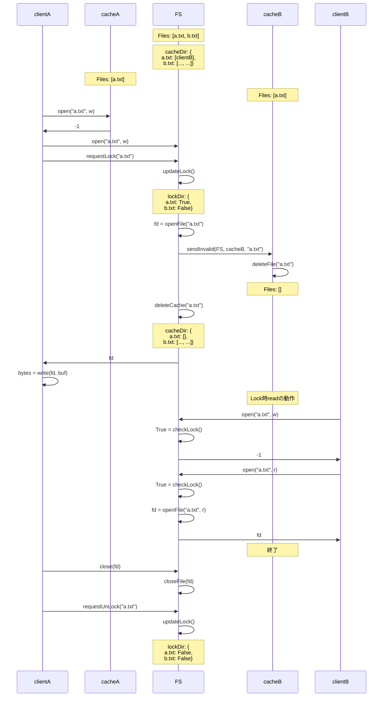
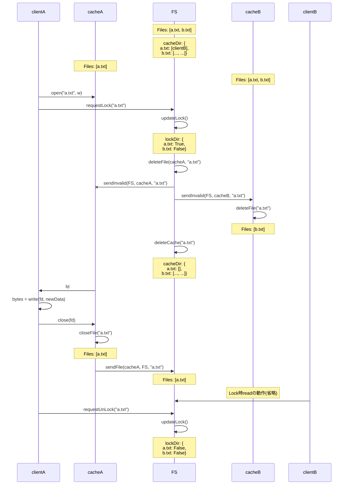

# os-b-dfs

## Flow
考え方
- clintとcacheはローカルにある、FSはリモートにある。
- キャッシュの更新、削除はopen時にやっておくと楽だからそうする。
- 初めてopen(file, r)するときにキャッシュする。
- FSでキャッシュを持ってるclientを記録しておく。cacheDir:{file, client}で管理する。
- open(file, w)するとき、キャッシュを持ってるclientにinvalidを送る。
- invalidを受け取ると、そのファイルを削除する。
- FSでLock状態のファイルを記録しておく。lockDir:{file, state}で管理する。
- open(file, w)するとき、requestLockを送信し、lockDirを更新して、そのファイルをロック状態にする。cacheからFSにファイルが同期されたら、requestUnLockを送信して、lockDirを更新して、ロック状態を解除する。ロック状態はreadできるがwriteできない。clientはFSにアクセスするときに、lockdirをチェックする。

### キャッシュなしread
キャッシュがない場合は直接リモートサーバを読みにいく、リモートサーバからキャッシュにコピーしておく。

### キャッシュありread
キャッシュあるなら、キャッシュを読みにいく、一番簡単

### キャッシュなしwrite
キャッシュがないなら、直接リモートサーバを書き換える。open時にキャッシュの無効化とファイルロックを行う。close後にファイルロックを解除する。

### キャッシュありwrite
キャッシュがあるなら、キャッシュの内容を書き換える。open時にキャッシュの無効化とファイルロックを行う。closeしたのはキャッシュにあるファイルなので、キャッシュからリモートサーバにコピーしてから、ファイルロックを解除する。

