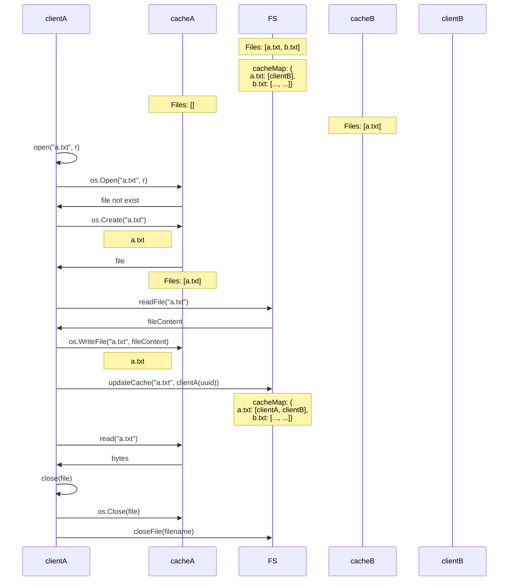
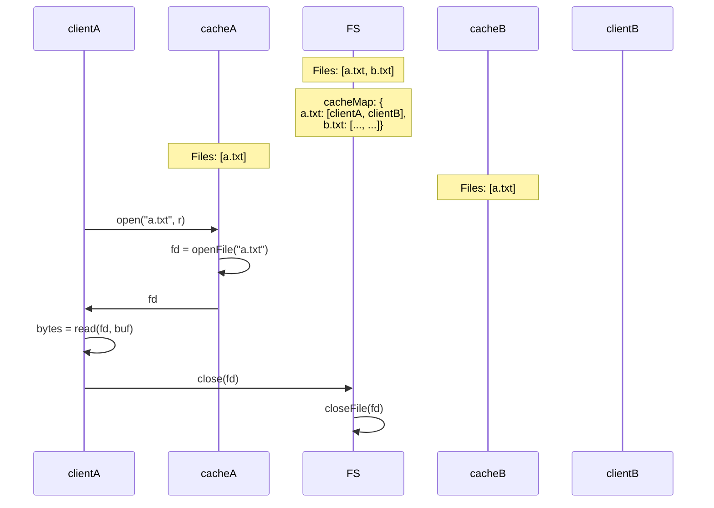
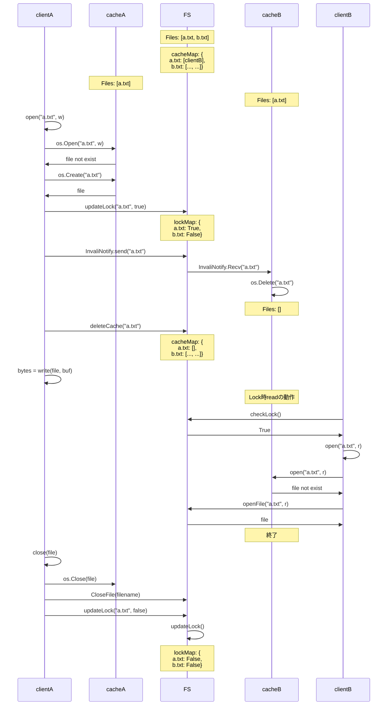
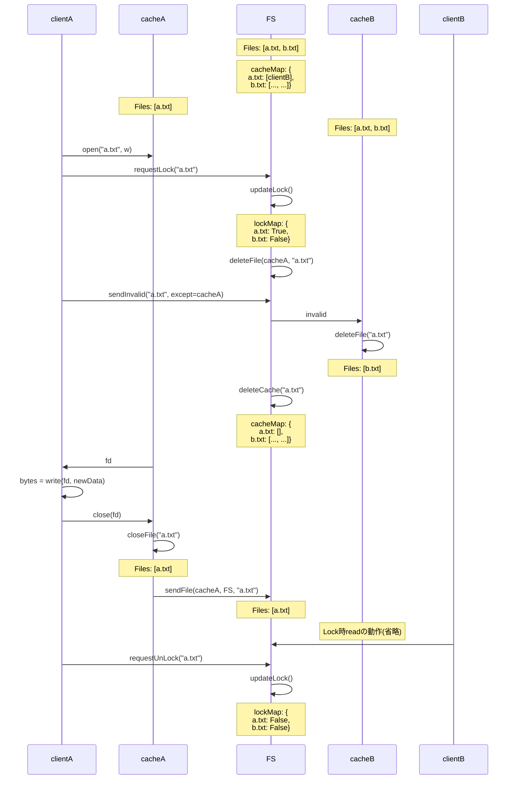

# os-b-dfs

## Flow
考え方
- clintとcacheはローカルにある、FSはリモートにある。
- キャッシュの更新、削除はopen時にやっておくと楽だからそうする。
- 初めてopen(file, r)するときにキャッシュする。
- FSでキャッシュを持ってるclientを記録しておく。cacheMap:{file, client}で管理する。
- open(file, w)するとき、キャッシュを持ってるclientにinvalidを送る。
- invalidを受け取ると、そのファイルを削除する。
- FSでLock状態のファイルを記録しておく。lockMap:{file, state}で管理する。
- open(file, w)するとき、requestLockを送信し、lockMapを更新して、そのファイルをロック状態にする。cacheからFSにファイルが同期されたら、requestUnLockを送信して、lockMapを更新して、ロック状態を解除する。ロック状態はreadできるがwriteできない。clientはFSにアクセスするときに、lockMapをチェックする。
- open, read, write, closeの引数、返り値はlinuxを真似してる、goのf.Read, f.Writeも似たような引数と返り値を取ってるから実装しやすい


論点
- リモートサーバやキャッシュサーバの関数を実装する時どうするか
1. 関数名と引数の文字列をパースする
2. gRPCていうのを使う(参考: https://zenn.dev/hsaki/books/golang-grpc-starting/viewer/intro)
- フロー図においてリモートの関数とローカルの関数をあまり区別できてないから要修正


### キャッシュなしread
キャッシュがない場合は直接リモートサーバを読みにいく、リモートサーバからキャッシュにコピーしておく。

### キャッシュありread
キャッシュあるなら、キャッシュを読みにいく、一番簡単


### キャッシュなしwrite
キャッシュがないなら、直接リモートサーバを書き換える。open時にキャッシュの無効化とファイルロックを行う。close後にファイルロックを解除する。


### キャッシュありwrite
キャッシュがあるなら、キャッシュの内容を書き換える。open時にキャッシュの無効化とファイルロックを行う。closeしたのはキャッシュにあるファイルなので、キャッシュからリモートサーバにコピーしてから、ファイルロックを解除する。



## ファイル構成(要検討)

```
./src
├─ code
│   ├─ file-server
│   │   └─ main.go
│   ├─ cache
│   │   └─ main.go
│   └─ client
│       └─ main.go
├─ file
│   ├─ file-server(file-server/main.goを起動すると生成)
│       ├─ a.txt
│       └─ b.txt
│   ├─ clientA(client/main.goを起動すると生成)
│       └─ a.txt
│   └─ clientB(さらにclient/main.goを起動すると生成)
│       ├─ a.txt
│       └─ b.txt 
```